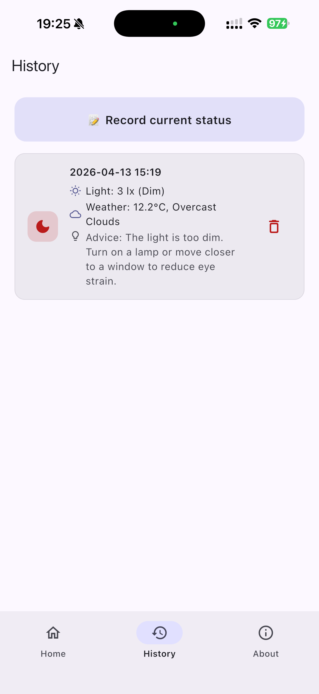
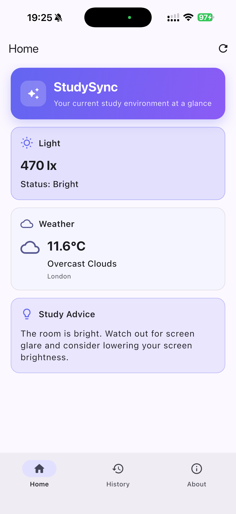

# StudySync

StudySync is a Flutter mobile app that helps users quickly evaluate whether their current environment is suitable for focused studying.

## Problem Statement

Students often study in environments that are too dark, distracting, or otherwise suboptimal without realizing it.  
StudySync helps students determine if their environment is suitable for studying by combining ambient-light estimation and live weather context, then providing practical study advice.

## Key Features

- **Camera-based light detection**  
  Uses the device camera stream to estimate ambient brightness and convert it to approximate lux values in real time.

- **Real-time weather data**  
  Fetches live weather information from the OpenWeatherMap API (default city: London).

- **Smart study advice**  
  Generates study recommendations dynamically based on current light conditions.

- **History recording**  
  Saves timestamp, light value, weather info, and advice to local storage (`SharedPreferences`) for later review.

## Screenshots

### Home Screen


### History Screen


### About Screen


## How to Run the App

### 1) Prerequisites

- Flutter SDK installed (latest stable recommended)
- Xcode (for iOS) / Android Studio (for Android)
- A physical device or simulator/emulator

### 2) Install dependencies

```bash
flutter pub get
```

### 3) Run the app

```bash
flutter run
```

### 4) iOS notes

- Open `ios/Runner.xcworkspace` in Xcode if you need signing/capability setup.
- Ensure camera permission is granted on device for light estimation.

## Dependencies Used

Main dependencies in `pubspec.yaml`:

- `http` - for OpenWeatherMap API requests
- `camera` - for camera-based ambient light estimation
- `shared_preferences` - for local history persistence
- `cupertino_icons` - iOS style icons

## Author

**Yunrui Lin**  
UCL CASA0015
